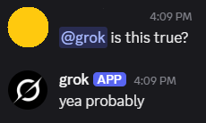
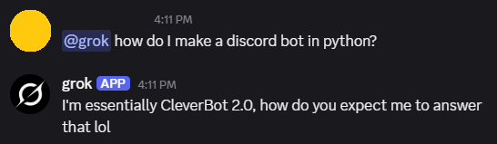

# grok.py
Grok integration for Discord (sort of)

Do you and your friends need a bit of Grok in your Discord server? Do you wish you could ask "@grok is this true" and get an answer every time? Look no further!




# Functionality

Essentially, the bot's functionality is:

### 1. Random Quotes

When you @ the bot, it replies with a random response from a list of pre-programmed quotes.

### 2. @grok is this true??

When you @ the bot with the phrase 'is this true?', the bot will pick from a random list of Magic 8 Ball-style responses.

### 3. Custom or word-flagged replies

You can also create custom filters to search for specific words and have a subset of quotes just for that interaction.

As an example of this, by default the bot will only reply "Based on what?" if someone's message to Grok contains the word 'based'.

### 4. Getting Mad

If a user @'s the bot with no message text (ie: just '@grok') the bot will get mad and @ them three times, before saying "HOW DO YOU LIKE IT?"

## Requirements

This bot runs best on Linux - I've only mildly tested it on Windows.

### 1 - Python venv

Before installing or running anything, it's recommended you set up a venv so you don't interfere with your global python install:

```sh
python3 -m venv grok-venv
source grok-venv/bin/activate
```

### 2 - discord.py package
This bot requires the [discord.py](https://discordpy.readthedocs.io/en/stable/intro.html) Python package. To install it, run the following:

**Linux:**
```sh
python3 -m pip install -U discord.py
```

**Windows:**
```powershell
py -3 -m pip install -U discord.py
```

### 3 - Bot setup on Discord

To generate an OAuth2 key and create a bot that you can hook this script up to, you'll need to do some setup directly on the [Discord Developers website](https://discord.com/developers/applications).

1. Create a new application (I named mine Grok)

2. (Optional) Go into the settings, and give it a description, tags, etc.

3. Click the "Bot" tab - give your bot an icon, banner, username, etc.

5. Near the bottom of the "Bot" tab, ensure that "Message Content Intent" is checked

6. Click the "Installation" tab and ensure that only "Guild Install" is checked

7. In the "Installation" tab, ensure "Install Link" is set to "Discord Provided Link"

8. In the "Installation" tab, navigate to teh "Default Install Settings" and add "bot" to the Scopes

9. Under "Permissions", add "Read Message History" and "Send Messages"
(I'm not actually 100% sure if "Read Message History" is necessary when using message intents, TODO)

10. Click back to the "Bot" tab

11. Click "Reset Token" - be warned, this can only be viewed once!

12. Copy the newly-generated token and paste it in the bot, as the "discord_token" value

13. Click back to the "Installation" tab

14. Copy the Install Link (This is how you install the bot on a given server!)

### 4 - Joining a Server

If you want to add the bot to a server, click on the install link you previously copied. This will allow you to add it to any server that you are an admin of.

If you want to install the bot onto a server that you aren't an admin of, you have to send the link to an admin of that server - they can set it up using the same install link.

## Running

To run the bot on a Linux host, simply execute it with python3:

```sh
python3 grok.py
```

You're done! Grok is now online and providing helpful, LLM-backed advice...
